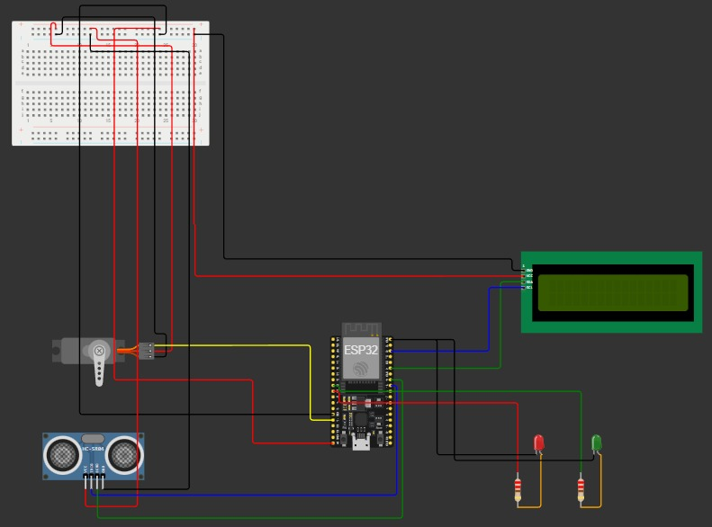

# 🚧 Smart Automatic Toll Gate using ESP32 & HC-SR04

[](https://www.espressif.com/en/products/socs/esp32)
[](https://cplusplus.com/)
[](https://opensource.org/licenses/MIT)

This project is a smart automatic toll gate simulation designed using an **ESP32** microcontroller. The system detects the presence of approaching objects using an ultrasonic sensor (HC-SR04) and automatically controls a servo motor to open or close the gate. It is equipped with LED indicators and an I2C LCD screen for real-time visual feedback.

---

## 🎯 Key Features

* **Automatic Detection:** Automatically opens the gate when an object is detected within a specified radius (10 cm).
* **Smart Auto-Close Delay:** The gate does not close immediately. There is a safety delay (1 second) after the sensor area is clear before the gate closes again.
* **Visual Status Indicators:**
    * 🔴 **Red LED:** Gate closed ("Wait" status).
    * 🟢 **Green LED:** Gate open ("Go" status).
* **Informative LCD Display:** Shows real-time statuses such as `"Silahkan Mendekat"` (Please Approach), `"Pintu Terbuka"` (Gate Open), and `"Pintu Menutup"` (Gate Closing).
* **State Machine Logic:** The code is written using a state machine approach (TERTUTUP, MEMBUKA, TERBUKA, MENUTUP) to ensure movement and logic are responsive and non-blocking.

---

## 🛠️ Components Used

1.  **ESP32 Development Board** (As the main controller)
2.  **HC-SR04 Ultrasonic Sensor** (For object distance detection)
3.  **Servo Motor** (To drive the toll gate)
4.  **16x2 LCD with I2C Module** (To display status messages)
5.  **2x LEDs** (Red & Green, as traffic light indicators)
6.  **2x Resistors** (220/330 ohm for the LEDs)
7.  **Breadboard & Jumper Wires**

---

## 🔌 Wiring Diagram

Below is the schematic diagram based on the provided wiring setup:



### Pin Connection Table

| Component | Component Pin | ESP32 Pin | Description |
| :--- | :--- | :--- | :--- |
| **HC-SR04** | VCC | VIN / 5V | Power supply |
| | GND | GND | Ground |
| | TRIG | GPIO 18 | Triggers ultrasonic signal |
| | ECHO | GPIO 19 | Receives signal reflection |
| **Servo Motor** | VCC (Red) | VIN / 5V | Power supply |
| | GND (Brown/Black)| GND | Ground |
| | Signal (Yellow/Orange)| GPIO 13 | PWM control signal (90°/180° angle) |
| **I2C LCD 16x2**| VCC | VIN / 5V | Power supply |
| | GND | GND | Ground |
| | SDA | GPIO 21 | I2C Data |
| | SCL | GPIO 22 | I2C Clock |
| **LED Indicators**| Green LED (Anode) | GPIO 25 | Via resistor (Go indicator) |
| | Red LED (Anode) | GPIO 26 | Via resistor (Stop indicator) |
| | All LED Cathodes | GND | Ground |

---

## 🚀 How to Use & Installation

1.  **Clone the Repository:**
    ```bash
    git clone [https://github.com/your_username/Smart-Toll-Gate-ESP32.git](https://github.com/your_username/Smart-Toll-Gate-ESP32.git)
    ```
2.  **Arduino IDE Setup:**
    * Ensure the **ESP32** board manager is installed in your Arduino IDE.
    * Install the following libraries via the **Library Manager** (Sketch -> Include Library -> Manage Libraries):
        * `LiquidCrystal I2C` (by Frank de Brabander)
        * `ESP32Servo` (by Kevin Harrington, John K. Bennett)
3.  **Upload the Code:**
    * Wire the components according to the diagram above.
    * Open the `.ino` program file.
    * Select the appropriate *Board* (e.g., "DOIT ESP32 DEVKIT V1") and *Port*.
    * Click **Upload**.

---

## 💡 Brief Code Logic Explanation

This program uses a simple **Finite State Machine (FSM)** with the `statusPintu` variable. 
* When `bacaJarakCm()` detects an object below `batasJarakCm` (10 cm), the status changes to `MEMBUKA` (Opening), then `TERBUKA` (Open). The servo rotates to 90 degrees.
* If the object leaves, the program starts tracking time (using `millis()`).
* After `jedaTutupMs` (1000 ms / 1 second) passes without an object, the status changes to `MENUTUP` (Closing), the servo returns to 180 degrees, and the status becomes `TERTUTUP` (Closed).
* Using `millis()` ensures the program is non-blocking (unlike using `delay()`), so the system remains responsive to reading the sensor while waiting.

---

<p align="center">
  Built with 💻 & ☕ by <b>Moh. Ilham Ramadan</b>
</p>
